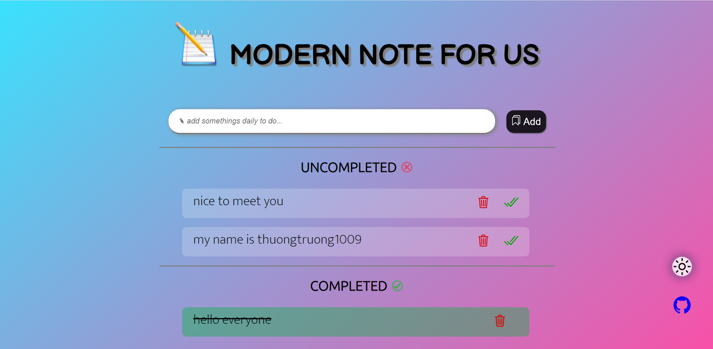
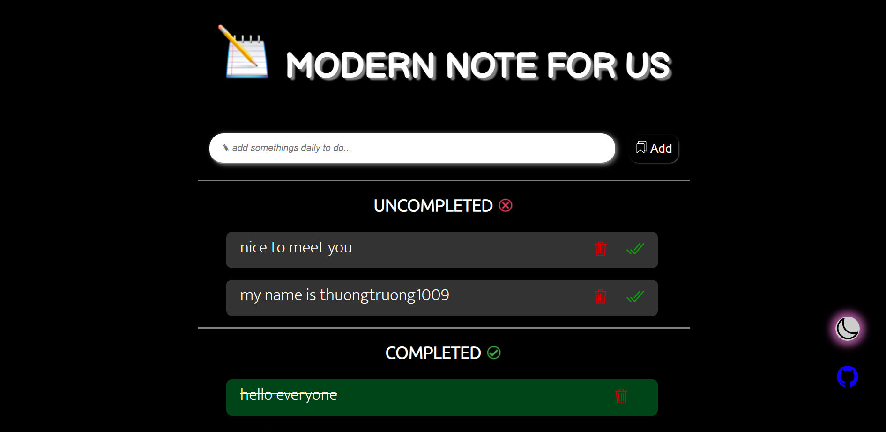

<h1 align="center">DEV NOTE PRO</h1>


[](https://app.netlify.com/sites/notedev/deploys)

---
### Screen shots




---
### How to install - ViteJs 3 template at https://vitejs.dev/
+ Install NodeJs and NPM module at https://nodejs.org/
+ Check version, use cmd or any text editor.
```script
$ node --v
$ npm --v
```
+ With NPM
```script
$ npm init vite@latest
----------------------------------------------------------
npm init vite@latest my-vue-app -- --template vue
```
+ With YARN
```script
$ yarn create vite
----------------------------------------------------------
yarn create vite my-vue-app --template vue
```
+ To install configs and modules pf NPM
```script
npm install
```
+ To run virtual internal preview on browser
```script
npm run dev
```
+ To build production on website
```script
npm run build
```
+ To test with npm
```script
npm run test
```
+ WindiCSS with Vite
```script
https://windicss.org/integrations/vite.html
```
---
### Refference
- Recommended IDE Setup [VSCode](https://code.visualstudio.com/) + [Volar](https://marketplace.visualstudio.com/items?itemName=johnsoncodehk.volar)
- Use Netlify to build product - https://netlify.com/
- Get icon packages at https://ionicons.com/
- Learn Front-end for beginner at at https://github.com/thuongtruong1009/challenge-resposive-web-design
---
### --> You can clone/fork/download or contribute and discuss them to develop. It can save it on release history.
### --> All problems or contact should take a mail to ititiu19228@student.hcmiu.edu.vn
### --> Support me at 
### Thank you!

